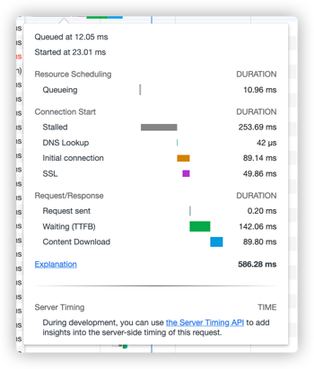

浏览器请求页面流程梳理

**Queueing**请求排队的时间。关于这个，需要知道一个背景，就是浏览器与同一个域名建立的TCP连接数是有限制的，chrome设置的6个，如果说同一时间，发起的同一域名的请求超过了6个，这时候就需要排队了，也就是这个Queueing时间
**Stalled**是浏览器得到要发出这个请求的指令，到请求可以发出的等待时间，一般是代理协商、以及等待可复用的TCP连接释放的时间，不包括DNS查询、建立TCP连接等时间等
**DNS Lookup DNS**查询的时间，页面内任何新的域名都需要走一遍 完整的DNS查询过程，已经查询过的则走缓存
**Initial Connection / Connecting** 建立TCP连接的时间，包括TCP的三次握手和SSL的认证
**SSL**完成ssl认证的时间
**Request sent/sending**请求第一个字节发出前到最后一个字节发出后的时间，也就是上传时间
**Waiting** 请求发出后，到收到响应的第一个字节所花费的时间(Time To First Byte)
**Content Download** 收到响应的第一个字节，到接受完最后一个字节的时间，就是下载时间